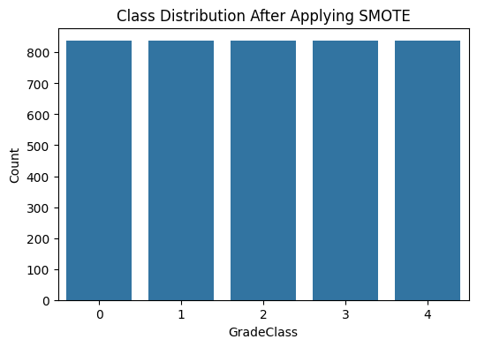
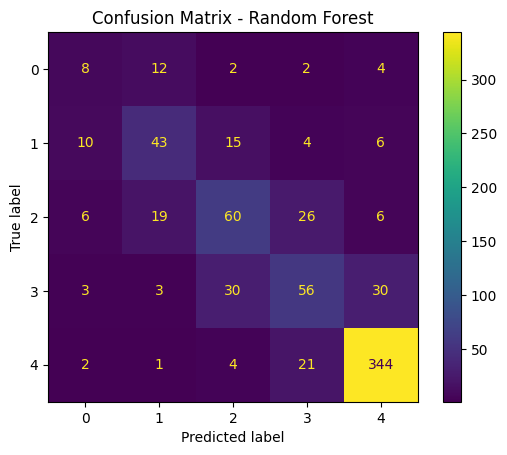
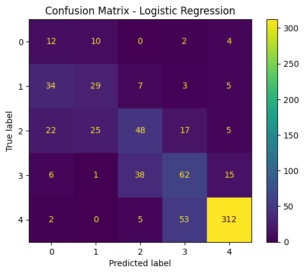
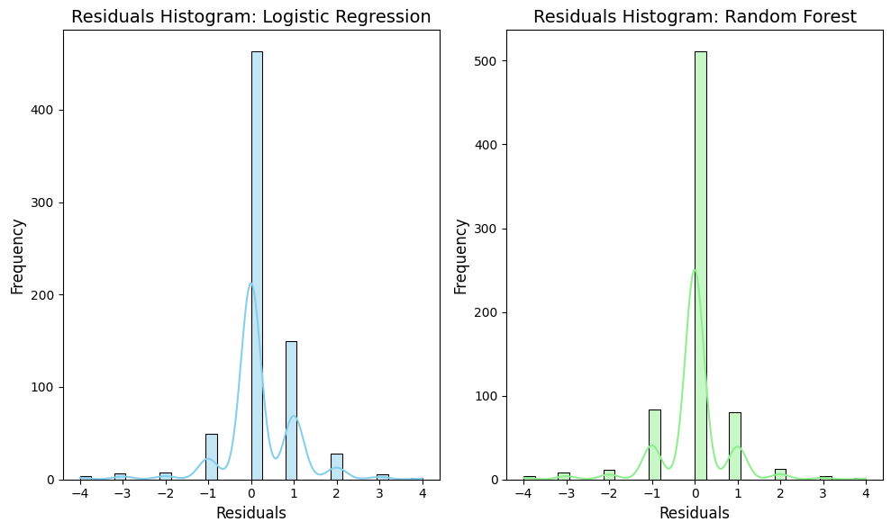
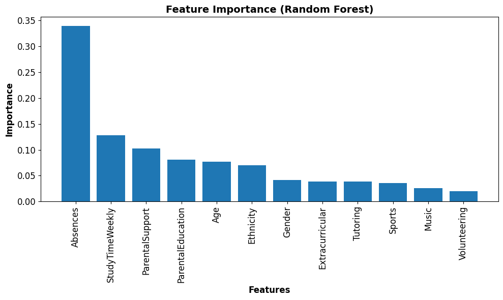
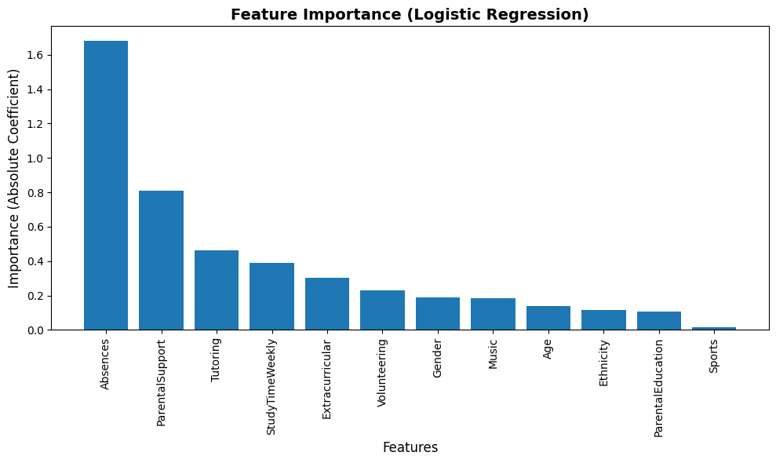

# Student Grade Prediction with Machine Learning

A machine learning project that predicts a student's **grade class (A–F)** from study habits, attendance, parental involvement and extracurricular activities. It compares a tuned **Random Forest** with **Logistic Regression**, and identifies the factors that most influence academic performance.

**Best model:** Random Forest, with **71.3% accuracy** and a **0.708 weighted F1-score** across 5 classes.

> Coursework for Introduction to Artificial Intelligence (CIS2205), University of Huddersfield, 2024.

---

## Why It Matters

If a school can predict which students are likely to fall behind, it can step in early with tutoring, attendance support or parental engagement. This project shows which factors matter most and how reliably at-risk students can be identified.

---

## Dataset

- [Students Performance Dataset](https://www.kaggle.com/datasets/rabieelkharoua/students-performance-dataset) (Kaggle), with **2,392 students**
- **Features:** age, gender, ethnicity, parental education, weekly study time, absences, tutoring, parental support, extracurricular activities, sports, music and volunteering
- **Target, `GradeClass`:** 0 = A (GPA ≥ 3.5), 1 = B, 2 = C, 3 = D, 4 = F (GPA < 2.0)

*The dataset is not included in this repository. Download it from Kaggle and save it as `Student_performance_data.csv` next to the notebook.*

---

## Approach

**1. Preprocessing**
- Filled missing values (mean for numeric columns, mode for categorical)
- Removed outliers with the **IQR method**
- Encoded categorical variables and standardised features with `StandardScaler`
- **Dropped `GPA` to prevent data leakage**, since the target is calculated directly from GPA
- Split 70/30 into training and test sets

**2. Handling class imbalance with SMOTE**

Most students fall into grade F, so **SMOTE** was applied to the training data only, creating synthetic examples until every class had 837 samples.

**3. Hyperparameter tuning with GridSearchCV (3-fold cross-validation)**

| Model | Parameters searched | Best parameters |
|---|---|---|
| Random Forest | `n_estimators`: 50, 100, 200 · `max_depth`: 10, 20, 30 | 200 trees, max depth 20 |
| Logistic Regression | `C`: 0.1–100 · penalty: L2, Elastic Net · solver: saga | C = 0.1, Elastic Net (l1_ratio 0.75) |

---

## Results

| Metric (weighted) | Random Forest | Logistic Regression |
|---|---|---|
| **Accuracy** | **0.713** | 0.646 |
| **Precision** | **0.704** | 0.686 |
| **Recall** | **0.713** | 0.646 |
| **F1-Score** | **0.708** | 0.662 |

**Random Forest outperformed Logistic Regression on every metric.**

| Random Forest | Logistic Regression |
|---|---|
|  |  |

### Key findings
- **Identifying at-risk students works well.** Random Forest reached **0.88 precision and 0.92 recall** for grade F students (class 4).
- **Grade A students are the hardest to predict.** Only 28 students in the test set had an A, so there were few real examples to learn from. Logistic Regression had better recall here (0.43 vs 0.29).
- **Middle grades (B–D) are often confused** with each other, because their feature profiles overlap.
- Random Forest's residuals cluster more tightly around zero, meaning fewer and smaller errors.

---

## What Drives Student Grades?

- **Absences** are by far the strongest predictor of grade.
- **Weekly study time** and **parental support** come next.
- Logistic Regression coefficients confirm that absences dominate, followed by parental support and tutoring.

<b>Logistic Regression feature importance</b>

**Takeaway for educators:** improving attendance is likely to have the biggest impact on student outcomes.

---

## Tech Stack

`Python` · `pandas` · `NumPy` · `scikit-learn` · `imbalanced-learn (SMOTE)` · `Matplotlib` · `Seaborn` · `Jupyter`

## How to Run

1. Click **Open in Colab** above, or clone the repo and open the notebook in Jupyter or VS Code.
2. Download the dataset from Kaggle and save it as `Student_performance_data.csv` in the same folder.
3. Install dependencies if needed: `pip install pandas numpy scikit-learn imbalanced-learn matplotlib seaborn joblib`
4. Run all cells.

---

## Future Improvements

- Try gradient boosting models (XGBoost, LightGBM)
- Use a scikit-learn `Pipeline` so scaling is fitted on training data only
- Use stratified cross-validation for the final evaluation
- Predict GPA directly as a regression task

---

**Author:** Ayesha Sohail · [GitHub](https://github.com/ayesha112244)
